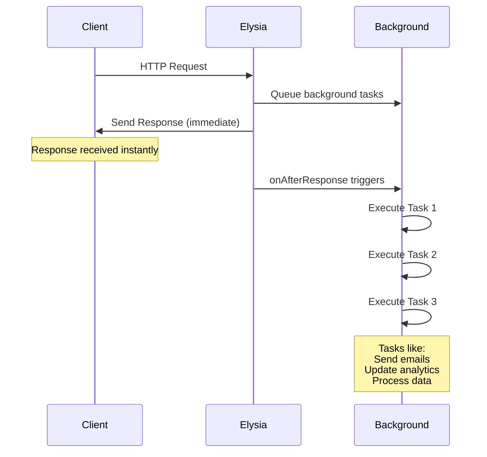

# Elysia Background

A background task processing plugin for Elysia.js that executes async tasks after sending HTTP responses. Inspired by [Starlette's background tasks](https://www.starlette.io/background/).

> [!IMPORTANT]  
> Currently only supports async functions. Synchronous functions are not supported at this time.

## Installation

```bash
bun add elysia-background
```

## Quick Start

```typescript
import { Elysia } from "elysia";
import { background } from "elysia-background";

const app = new Elysia()
  .use(background())
  .post("/sign-up", ({ backgroundTasks, body }) => {
    // Do some processing

    backgroundTasks.addTask(async () => {
      await sendConfirmationEmail(body.email);
    });

    // Response sent immediately, tasks run in background
    return { message: "Registration successful!" };
  })
  .listen(3000);
```

## Error Handling

Background tasks execute sequentially. If one task fails, execution stops and subsequent tasks are not executed.

**Default Behavior:**
Errors are logged to console with `[elysia-background] Task failed:` prefix.

**Custom Error Handler:**

```typescript
const app = new Elysia()
  .use(
    background({
      onError: (error) => {
        console.error("Task failed:", error);
        // You can send to monitoring service, etc.
      },
    })
  )
  .post("/users", ({ backgroundTasks, body }) => {
    backgroundTasks.addTask(async () => {
      await sendWelcomeEmail(body.email);
    });
    return { message: "User created" };
  });
```

## Workflow



Background tasks execute sequentially after the HTTP response is sent, ensuring reliable and predictable processing.

## API Reference

### Core Functions

#### `background(options?)`

> Creates an Elysia plugin for background task processing.

**Signature:**

```typescript
function background(options?: BackgroundOptions): Elysia;
```

**Parameters:**

- **`options`** `BackgroundOptions` _(optional)_ - Configuration object with error handling

**Returns:**

- `Elysia` - Plugin instance ready to be used with `.use()`

**Example:**

```typescript
// Basic usage
const app = new Elysia().use(background());

// With custom error handling
const app = new Elysia().use(
  background({
    onError: (error) => console.error("Task failed:", error),
  })
);
```

---

### Types & Interfaces

#### `BackgroundOptions`

> Configuration options for the background plugin.

**Definition:**

```typescript
type BackgroundOptions = {
  onError?: (error: unknown) => void | Promise<void>;
};
```

**Properties:**

- **`onError`** `(error: unknown) => void | Promise<void>` _(optional)_
  - Error handler for failed background tasks
  - Supports both synchronous and asynchronous handlers
  - **Default:** Console logging with `[elysia-background] Task failed:` prefix

---

#### `TaskFunction<P>`

> Type definition for background task functions.

**Definition:**

```typescript
type TaskFunction<P extends any[]> = (...args: P) => void | Promise<void>;
```

> **Note:** Only async functions are supported. Sync functions will throw an error during execution.

---

#### `IBackgroundTask`

> Interface implemented by both `BackgroundTask` and `BackgroundTasks`.

**Definition:**

```typescript
interface IBackgroundTask {
  run(): Promise<void>;
}
```

---

### Classes

#### `BackgroundTasks`

> Manages background tasks for a request. Available in route handlers via the `backgroundTasks` context property.

**Declaration:**

```typescript
class BackgroundTasks implements IBackgroundTask
```

##### Constructor

```typescript
constructor(tasks: BackgroundTask<any[]>[] = [])
```

**Parameters:**

- **`tasks`** `BackgroundTask<any[]>[]` _(optional)_ - Initial array of background tasks, defaults to empty array

##### Properties

- **`tasks`** `readonly BackgroundTask<any[]>[]` - Readonly array of queued background tasks

##### Methods

###### `addTask(func, ...args)`

> Adds a background task to the execution queue.

**Signature:**

```typescript
addTask<P extends any[]>(func: TaskFunction<P>, ...args: P): void
```

**Parameters:**

- **`func`** `TaskFunction<P>` - Async function to execute
- **`...args`** `P` - Arguments to pass to the function

**Example:**

```typescript
// Simple task without arguments
backgroundTasks.addTask(async () => {
  await sendNotification();
});

// Task with arguments
backgroundTasks.addTask(
  async (email: string, subject: string) => {
    await sendEmail(email, subject);
  },
  "user@example.com",
  "Welcome"
);
```

###### `run()`

> Executes all queued tasks sequentially.

**Signature:**

```typescript
run(): Promise<void>
```

**Behavior:**

- Tasks execute in the order they were added
- If one task fails, execution stops immediately
- Called automatically after HTTP response is sent
- **Throws:** `Error` if any task fails

---

#### `BackgroundTask<P>`

> Individual background task wrapper. Generally not used directly by end users.

**Declaration:**

```typescript
class BackgroundTask<P extends any[]> implements IBackgroundTask
```

##### Constructor

```typescript
constructor(func: TaskFunction<P>, ...args: P)
```

**Parameters:**

- **`func`** `TaskFunction<P>` - The async function to execute
- **`...args`** `P` - Arguments to pass to the function

##### Properties

- **`func`** `TaskFunction<P>` - The function to execute
- **`args`** `P` - Arguments for the function
- **`isAsync`** `boolean` - Whether the function is async

##### Methods

###### `run()`

> Executes the background task.

**Signature:**

```typescript
run(): Promise<void>
```

**Throws:** `Error` if function is not async

---

## Examples

See the [examples](./examples/) folder for comprehensive usage examples.

## Development

```bash
# Install dependencies
bun install

# Lint and format
bun run lint
bun run format

# Run tests
bun test

# Build
bun run build
```

## Contributing

Contributions are welcome! Please open an issue or submit a pull request.

## License

MIT License - see [LICENSE](LICENSE) for details.

## Inspiration

Inspired by [Starlette's background tasks](https://github.com/encode/starlette/blob/master/starlette/background.py) for Python's FastAPI ecosystem.
