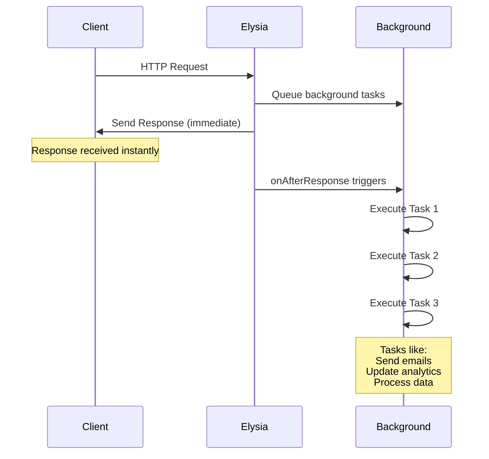

# Elysia Background

A background task processing plugin for Elysia.js that executes async tasks after sending HTTP responses. Inspired by [Starlette's background tasks](https://www.starlette.io/background/).

> [!IMPORTANT]  
> Currently only supports async functions. Synchronous functions are not supported at this time.

## Installation

```bash
bun add elysia-background
```

## Quick Start

```typescript
import { Elysia } from "elysia";
import { background } from "elysia-background";

async function sendConfirmationEmail(email: string, code: string) {
  console.log(`Sending confirmation email to ${email} with code ${code}`);
}

const app = new Elysia()
  .use(background())
  .post("/sign-up", ({ backgroundTasks, body }) => {
    // Do some processing

    backgroundTasks.addTask(sendConfirmationEmail, body.email, "123456");

    // Response sent immediately, tasks run in background
    return { message: "Registration successful!" };
  })
  .listen(3000);
```

## Error Handling

Background tasks execute sequentially. If one task fails, execution stops and subsequent tasks are not executed.

**Default Behavior:**
Errors are logged to console with `[elysia-background] Task failed:` prefix.

**Custom Error Handler:**

```typescript
const app = new Elysia()
  .use(
    background({
      onError: (error) => {
        console.error("Task failed:", error);
        // You can send to monitoring service, etc.
      },
    })
  )
  .get("/test", ({ backgroundTasks }) => {
    backgroundTasks.addTask(async () => {
      throw new Error("Simulated task failure");
    });
    return { message: "Task added" };
  });
```

## Workflow



Background tasks execute sequentially after the HTTP response is sent, ensuring reliable and predictable processing.

## API Reference

For detailed API documentation, see [docs/api-reference.md](docs/api-reference.md).

## Examples

See the [examples](./examples/) folder for comprehensive usage examples.

## Development

```bash
# Install dependencies
bun install

# Lint and format
bun run lint
bun run format

# Run tests
bun test

# Build
bun run build
```

## Contributing

Contributions are welcome! Please open an issue or submit a pull request.

## License

MIT License - see [LICENSE](LICENSE) for details.

## Inspiration

Inspired by [Starlette's background tasks](https://github.com/encode/starlette/blob/master/starlette/background.py) for Python's FastAPI ecosystem.
